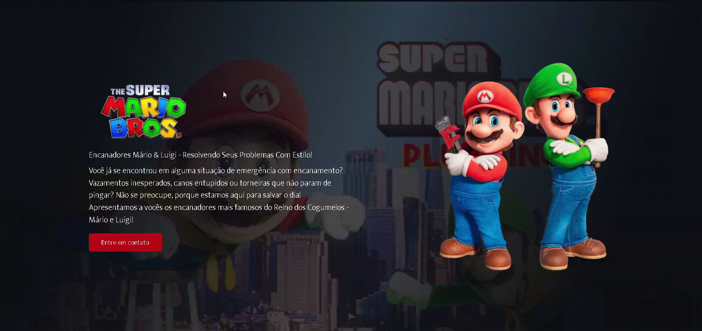

# 🍄 Projeto Super Mário

Um site inspirado no universo do **Super Mário**, criado para simular uma página de serviços fictícia dos encanadores Mário & Luigi.  
O projeto utiliza **vídeo de fundo**, layout responsivo e um **formulário de contato interativo**.



---

## 🚀 Tecnologias Utilizadas

- 🌐 **HTML5** → Estrutura do site  
- 🎨 **CSS3** → Estilização, responsividade e animações  
- ⚡ **JavaScript** → Interatividade (abrir/fechar formulário, validação, controle de máscara)

---

## 🎯 Funcionalidades

- ✅ Vídeo de fundo com máscara (efeito de foco)  
- ✅ Formulário de contato que abre em modal / slide dependendo da largura da tela  
- ✅ Validação de campos do formulário (bloqueio de envio quando vazio)  
- ✅ Fechar formulário por botão, clique fora ou tecla `ESC`  
- ✅ Layout responsivo para desktop, tablet e mobile  
- ✅ Botões com efeitos *hover* e transições suaves

---

## 📂 Estrutura do Projeto

```bash
📁 super-mario
├── index.html         # Estrutura principal
├── styles.css         # Estilos e responsividade
├── script.js          # Lógica do formulário e interações
├── video.mp4          # Vídeo de fundo
├── logo.png           # Logotipo principal
├── mario.png          # Imagem Mário & Luigi
├── assets/
│   └── animation.gif       # GIF de demonstração (preview)
└── README.md          # Documentação
